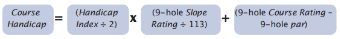

# Course Handicap Calculator

## Описание

Это Spring Boot приложение рассчитывает Course Handicap на основе предоставленных пользователем данных.

### Формула для расчета Course Handicap

#### For an 18-hole Round:


#### For an 9-hole Round:


### Граничные значения переменных

- `Handicap Index`: от -100 до 54
- `Slope Rating`: от 55 до 155
- `Course Rating`: от 20 до 100
- `Par`: от 20 до 90

## Установка и запуск

### Требования

- Docker
- Docker Compose (опционально)

### Запуск с Docker

```bash
docker build -t course-handicap-calculator .

docker run -d -p 80:8080 course-handicap-calculator
```

### Запуск с Docker Compose

```bash
docker-compose up --build -d
```

## Приложение будет доступно по адресу `http://localhost:80`.

